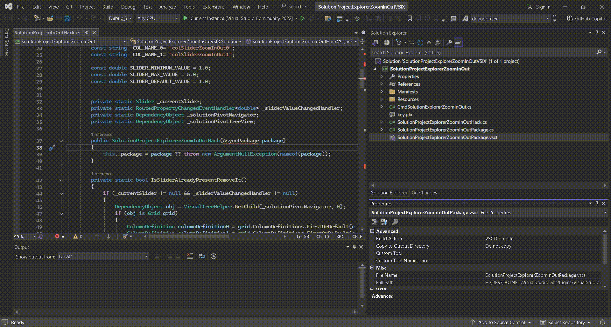

## Zoom In/Out in Visual Studio Solution Project Explorer

This Visual Studio extension allows you to dynamically adjust the zoom level using a slider integrated directly into the Solution Project Explorer panel.

## Features

* **Enable:** Go to the **Tools** menu and click the extension button [Project Explorer Zoom In/Out] to display the zoom slider.
* **Disable:** Press the **same button** [Project Explorer Zoom In/Out] in the Tools menu to hide the slider and restore the original layout.

## Supported Versions
* Visual Studio 2017
* Visual Studio 2019
* Visual Studio 2022
* Visual Studio 2026... just add configuration in csproj and build.bat script 
## Compilation & Build

To compile the extension for each specific version of Visual Studio, open the **Developer Command Prompt for VS 2022** and run the following commands sequentially:

```cmd
msbuild /t:Clean,Restore,Build /p:VsTargetVersion=VS2022 /p:Configuration=Release_VS2022 /p:Platform="x64"
msbuild /t:Clean,Restore,Build /p:VsTargetVersion=VS2019 /p:Configuration=Release_VS2019 /p:Platform="x86"
msbuild /t:Clean,Restore,Build /p:VsTargetVersion=VS2017 /p:Configuration=Release_VS2017 /p:Platform="x86"
```
To compile the extension for each specific version of Visual Studio in Visual Studio IDE : setup the configuration like above on UI
##### ** The solution was developed using Visual Studio Professional/Community 2022, with .NET 10 support taken into account, because I was too lazy to install Visual Studio 2026 (see the contents of the .csproj file).
##### For the multi-configuration setup, the idea comes from this website : 
* https://cezarypiatek.github.io/post/migrate-vsix-to-vs2022/


### Demonstration




## License

This project is licensed under the **GNU General Public License v3.0 (GPLv3)**. 

You are free to use, modify, and distribute this extension under the terms of this license. For more details, see the `LICENSE` file in the root directory of this repository.
